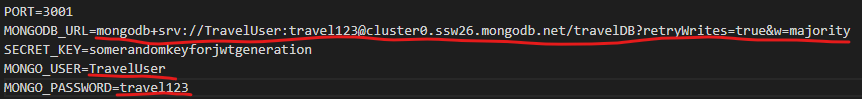

# Trainmasters - train travel project from group 8

## Code Standard
- ESLint will enforce some code standards, and will automatically warn if not followed when starting the app.
- No specific standard has implemented as of now, follow the project's existing standards.
    - E.g. indent lines by 2 spaces.

## Project Folder Structure
- **/api/**: root of the API server.
    - **/api/models/**: Definitions our MongoDB collections.
    - **/api/routes/**: Contains the defintiions for the API's endpoint and routes.
    - **/api/.env**: Environment variables.
    - **/api/testing/restclient/restclient.http**: Manual API route tests for use with the **REST Client** plugin for Visual Studio Code.
    - **/api/server.js**: Server's entrypoint with basic server config.
- **/client/**: root of the Frontend layer of the applicatio
    - **/client/pages/**: contains the different views displayed in the browser
    - **/client/src/contexts/**: currently two context variables are used in the app. They are wrapped around the `/App.js` as a context provider.
    - **/client/src/components/**: gathers all the smaller components with logic, ready to be served to different pages when needed.
    - **/client/src/styles/**: CSS files.
    - **/client/src/utils/**: utility helper classes to parse and format date variables and for field validation
    - **/client/.env**: Environment variables.
    - **/client/babel.config.js**: Required to enable supprot for ESM in **Jest** tests.

## Version Control
- Implement bugfixes and new features on a new by branching from the **staging**.
- Merge the latest **staging** changes into your branch before merging your branch into **staging**.
- Create PR (Pull Request) when done and merge your branch into **staging**.
- Once you have verified that no breaking changes have been introduced to **staging**, create a PR and merge **staging** into **main**.

- Branches:
    - **TESTING-BRANCH**: STD01
    - **TESTING-BRANCH-NEW**: STD02
    - **main**: latest changes with bug fixes ready before STD02 but not included in STD02 testing.
    - **staging**: latest changes with bug fixes ready before STD02 but not included in STD02 testing.

## Important setup requirements
- Clone the repository.

- Note that in order to start the app locally you need to start both the api and the client in separate terminals. 

In order to get the app running, theres a few accounts that needs to be created in order for the app to work:

- Create an account for MongoDB atlas. The login credentials needs to be exchanged in the .env file within the backend folder (api) so the backend can maintain a connection to the database.

    > Update the connection information in the project's **.env** file.
    

- Create a 2 dummy mail accounts. One acts as the apps client mail and one as the recipient of a booking confirmation. (Tip: mailtrap.io is a good way of setting up a test mail environment.) This is of course a temporary solution that will change to the users mail address in further development.

### Hosting

- To continue development new accounts would need to be created on **heroku.com**.
- Currently the backend and frontend are hosted seperately @ https://grupp-8-backend.herokuapp.com/ and https://grupp-8-frontend.herokuapp.com/
- It is is not ideal since it needs two accounts for heroku. A possible way to remedy this is to setup the backend to automatically serve the frontend to the user instead.

---

## Technology Stack
- MERN (MongoDB, Express.js, React, Node.js)

---

## API (backend)

Api is setup to run on localhost port 3001 (the port can be changed in the Api folders **.env** file).

### Node.js Scripts
- `npm install` - updates the api with the latest packages
- `npm start` - runs the backend **without** nodemon package (changes will not be instantly changed during local development, used for the deployed version at herokuapp)
- `npm run devstart` - runs the backend including the nodemon package (better for local development, enables hot-refresh)

### Technologies
- CORS (Cross-Origin Resource Sharing).
- crypto-js (Used to encrypt and decrypt passwords on login and account creation)
- jsonwebtoken (Used to create a JSON Web Token for use when authenticating users)
- Express.js (To create a server to run our API on)
- Mongoose (MongoDB database helper library)
- Nodemailer (To send email messages from our backend)
- Nodemon (To make the app react to changes made in active local development)

### The `Verify` middleware.
- Can be found in: `/verifyToken.js`
- Uses the **jsonwebtoken** package.
- The salt used in account creation and authentication is specified in our **.env** file under `SECRET_KEY`.

### Get started and run the app locally
1. Install **Node.js**, we recommend using the LTS (Long Term Support) branch, e.g. version 16.* (https://nodejs.org/en/).
1. Once **Node.js** has been installed, start/restart your Terminal and navigate to the `/api/` dir in the project.
1. Run `npm install` to install all dependencies.
1. Run `npm run devstart`.
1. The backend server is now running @ http://localhost:3001/

---

## Database
- MongoDB (See above on notes on how to connect to the database).

### Setup
> Collections are automatically created when the API app (backend) is started. You can easily add more collections by creating a new mongoose file in the api models folder.

- To populate the database with some initial data on available trips, you can use the **tripplans.json** file in `/docs/database json data/`.

---

## Client (frontend)

### Node.js Scripts
- `npm install`: 
    
    Install all dependencies. Try doing this before the start command if the app doesn't compile to resolve most issues automatically.
    
- `npm build`:

    Builds the app for production to the `build` folder.\
    It correctly bundles React in production mode and optimizes the build for the best performance.

    The build is minified and the filenames include the hashes.\
    Your app is ready to be deployed!

    See the section about [deployment](https://facebook.github.io/create-react-app/docs/deployment) for more information.

- `npm start` | `npm run start`:

    Runs the app in the development mode.\
    Open [http://localhost:3000](http://localhost:3000) to view it in the browser.

    The page will reload if you make edits.\
    You will also see any lint errors in the console.

- `start-nobrowser`: 
    
    Same as `npm start`, except that it doesn't open a browser window.

Client is setup to run on localhost port 3000 ([http://localhost:3000](http://localhost:3000)) (the port can be changed in the Client folders **.env** file)

### Technologies
> This project was bootstrapped with [Create React App](https://github.com/facebook/create-react-app).

- React
    - material-ui (GUI library with components such as Buttons)
    - **axios** (To make API requests against our API).
- Jest (Unit testing)
    - Only one simple test exists as of yet (found in **client/test/fieldValidation.test.js**)

### Get started and run the app locally
1. Install **Node.js**, we recommend the LTS (Long Term Support) branch, e.g. version 16.* (https://nodejs.org/en/).
1. Once **Node.js** has been installed, start/restart your Terminal and navigate to the `/client/` dir in the project.
1. Run `npm install` to install all dependencies.
1. Run `npm start` | `npm run start` | `npm run start-nobrowser`.
1. Frontend is now running @ http://localhost:3000/

### Tests
1. Follow the instructions under **Start locally** to install all dependencies.
1. Navigate to `/client/`.
1. Run `npm run test`

> Add new tests for the **frontend** app to `/client/tests/`.

---